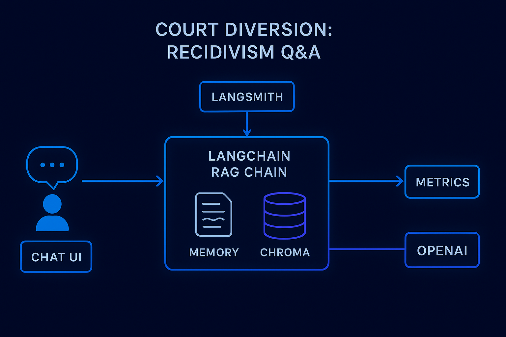

# ⚖️ Court Diversion: Recidivism Q&A (Streamlit + LangChain + LangSmith)

A GitHub‑ready starter that turns your existing Chroma vector index of diversion/recidivism records into a chat application with:
- **Streamlit UI** (chat-style)
- **Retriever‑augmented generation** over your Chroma store
- **Conversational memory** using `RunnableWithMessageHistory`
- **LangSmith observability** (traces, spans, token usage) when configured via env
- **Local metrics**: p95 latency, throughput (QPM), cost per call

<p align="center">
  
</p>

## ✨ Features

- Drop‑in **retriever** for your existing Chroma directory (`REVIEWS_CHROMA_PATH`).
- Clear **system prompt** capturing your recidivism definition and schema.
- **Session‑scoped memory** that keeps prior turns relevant.
- **LangSmith** integration via environment variables only.
- **Metrics** recorded locally to `metrics.jsonl` + Streamlit sidebar KPIs.

## 🧱 Project Structure

```
.
├─ app.py
├─ requirements.txt
├─ .env.example
├─ assets/
│  └─ architecture.png
└─ src/
   ├─ config.py
   ├─ memory.py
   ├─ pricing.py
   ├─ metrics.py
   ├─ vectorstore.py
   └─ chains.py
   └─ ingest.py
```

## 🚀 Quickstart

1) **Clone** and install deps

```bash
git clone https://github.com/prasannak29/Court-Diversion-Recidivism-Q-A-Streamlit-LangChain-LangSmith-
cd Court-Diversion-Recidivism-Q-A-Streamlit-LangChain-LangSmith-
python -m venv .venv && source .venv/bin/activate   # Windows: .venv\Scripts\activate
pip install -r requirements.txt
```

2) **Configure** environment

```bash
cp .env.example .env
# Fill in:
# OPENAI_API_KEY=...
# (optional) LANGSMITH_TRACING=true
# (optional) LANGSMITH_API_KEY=...
# (optional) LANGSMITH_PROJECT=court-diversion-app
# REVIEWS_CHROMA_PATH=...
```
3) **VectorDB** Creation
Builds the Chroma vector DB from a CSV dataset of court diversion records.

Usage:
~~~bash
    python src/ingest.py --csv data/diversion-demo.csv --persist chroma_data/ALM
~~~

4) **Run**

```bash
streamlit run app.py
```

Open the URL Streamlit prints and start chatting.

> **Note**: This repo assumes you already have a Chroma DB created at the path in `REVIEWS_CHROMA_PATH`. If not, populate it first with your documents.


## 🧠 Memory

We wrap the base chain with `RunnableWithMessageHistory`. Each Streamlit session gets a unique `session_id`, and a `ChatMessageHistory` keeps prior turns in memory. This keeps context tight to the current user while avoiding cross‑session bleed.

## 🔎 RAG Prompt

The system prompt encodes the recidivism rule you described:
- Consider only rows with **non‑null termination date**.
- For a given **ID**, if a **later received date** occurs **after** a prior termination date, that indicates recidivism.
- Use retrieved context to answer; say "unsure" when appropriate.

## 📈 Metrics (Local) + 💠 LangSmith

- We wrap each call with `get_openai_callback` to capture token usage and compute **cost per call** (configurable prices in `.env`). We also record **latency**.
- Metrics are written to `metrics.jsonl`. The Streamlit sidebar shows:
  - **p95 latency**
  - **Throughput QPM** (last 15 minutes)
  - **Avg cost per call**
  - **Total chats**

To enable **LangSmith**, just set:
```bash
export LANGSMITH_TRACING=true
export LANGSMITH_API_KEY=ls-...
export LANGSMITH_PROJECT=court-diversion-app
```
You'll see full traces, spans, inputs/outputs, token counts, and latencies in your LangSmith workspace.

## 🧪 Swapping Models

Use the sidebar to switch between compatible OpenAI chat models. Update `requirements.txt` if you add providers.

## 🔒 Security

- Keep your API keys in `.env` (never commit `.env`).
- Review dataset contents before deploying.

## 🛠️ Troubleshooting

- **Chroma import errors**: ensure the `REVIEWS_CHROMA_PATH` directory exists and was built with `OpenAIEmbeddings` compatible with your current environment.
- **Token/cost accuracy**: prices change; adjust `PRICE_INPUT_PER_1K` and `PRICE_OUTPUT_PER_1K` in `.env`.
- **LangSmith not logging**: confirm `LANGSMITH_TRACING=true`, `LANGSMITH_API_KEY`, and that your project name is correct.

---

Made with ❤️ using Streamlit, LangChain, and LangSmith.
